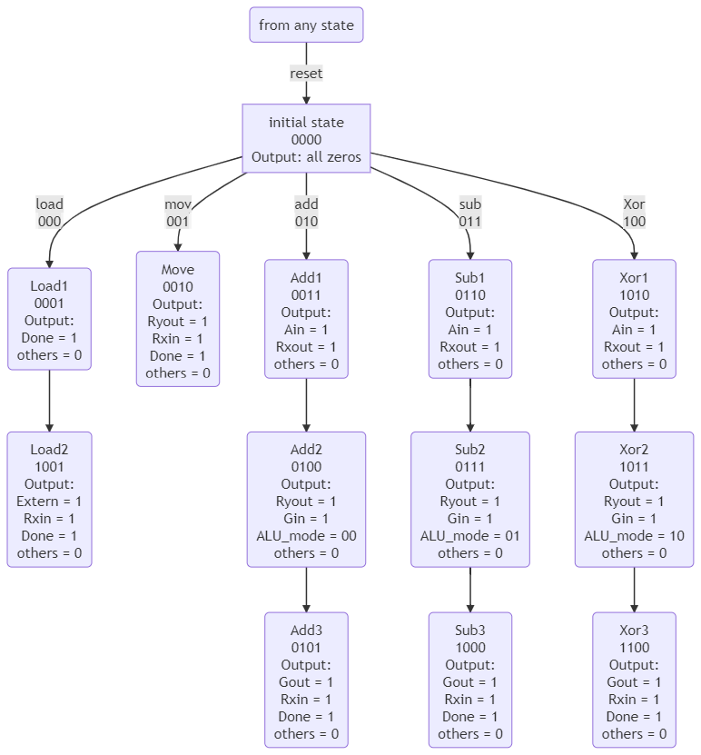
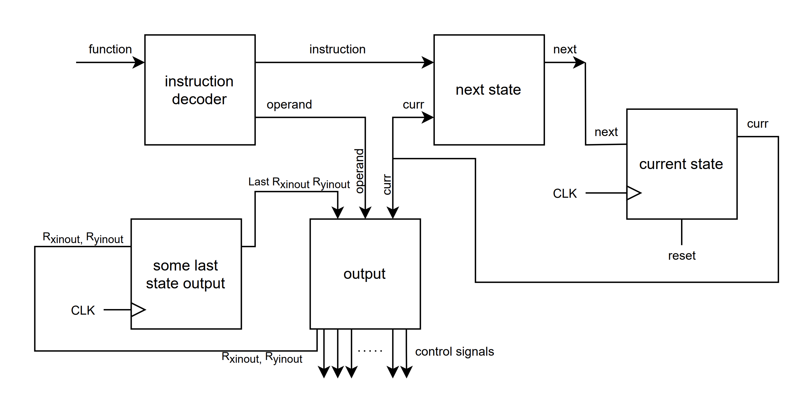

# To Do List 兄弟萌干活了！！
（不太会用md文件，撮合着看吧）  
所有的任务都列在这里，如果你完成了一项任务，请更新此文件 （i.e. 在完成的任务的地方加上关于你所做的工作的简洁的**英文**介绍，
目的是为了让别人可以看懂并调用你做的东西，同时你写的介绍也可用在这个project的documentation中）  

如果还有什么漏掉的内容的话请来补充

## control circuit
### FSM diagram
  
some more states to be added

### block diagram

### I/O explaination
- input
  - instruction
  - clk
  - reset
- output
  - Rin
  - Rout
  - ALU_a_in
  - ALU_g_in
  - ALU_g_out
  - Done
  - External_data
  - ALU_mode

## ALU

## register and Tri-state Vector
