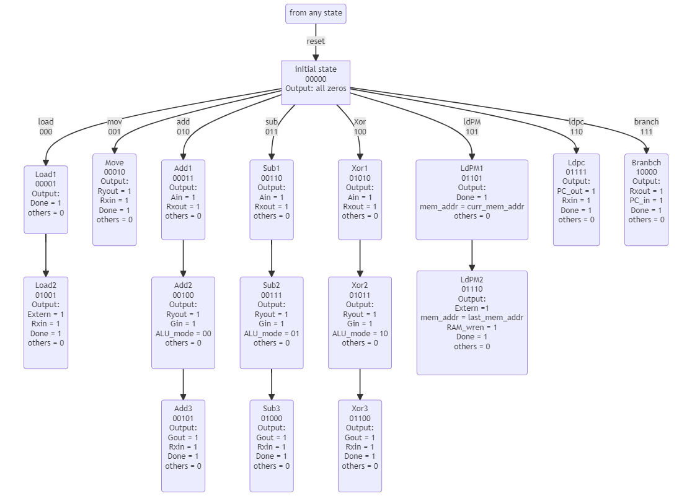
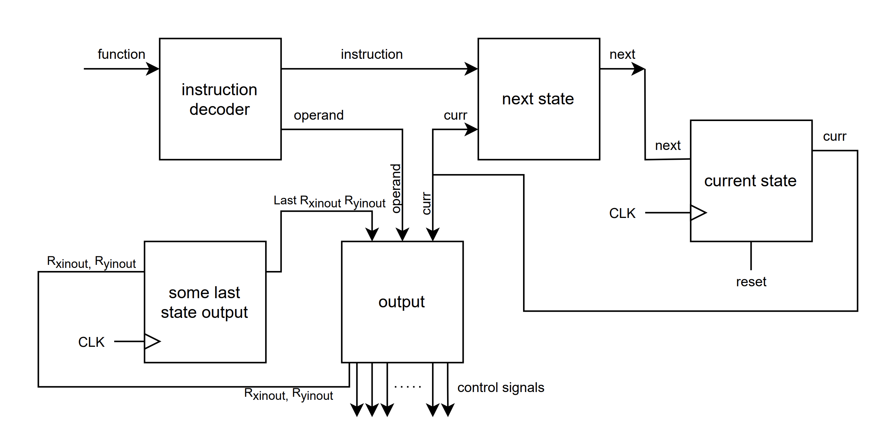
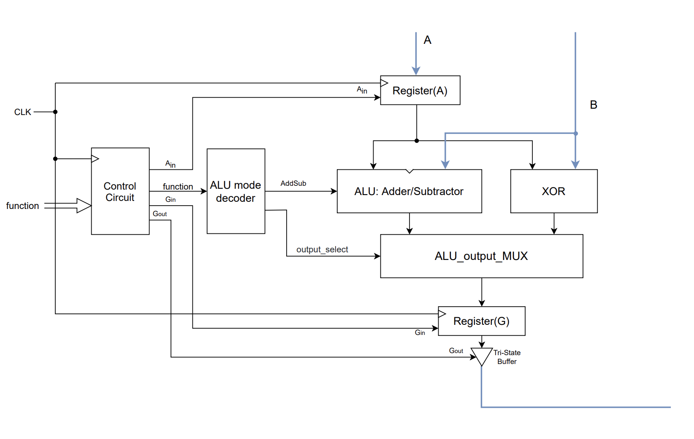
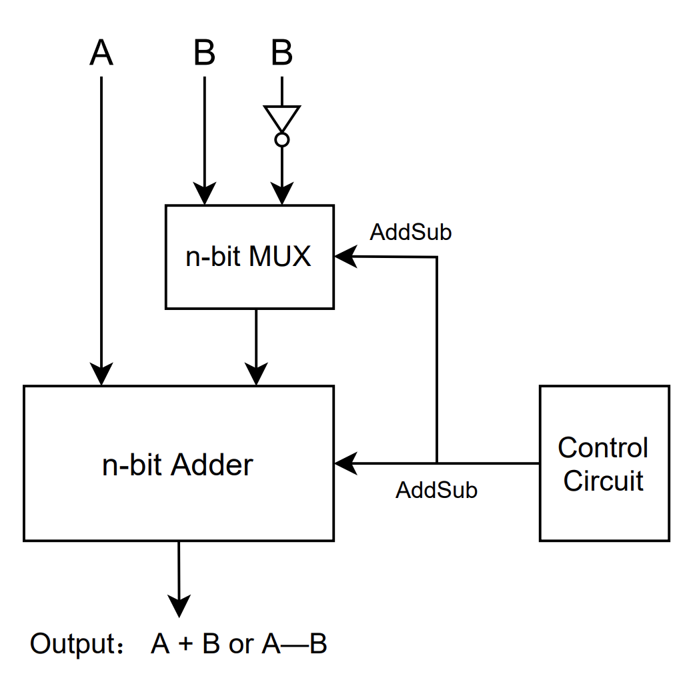
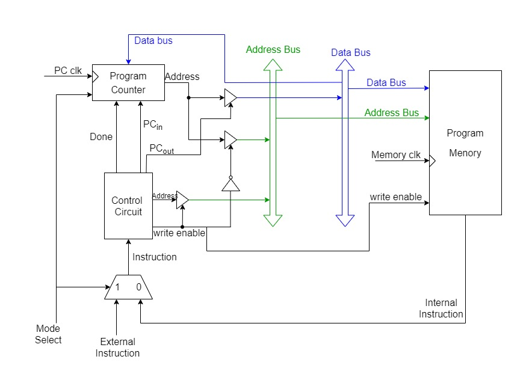
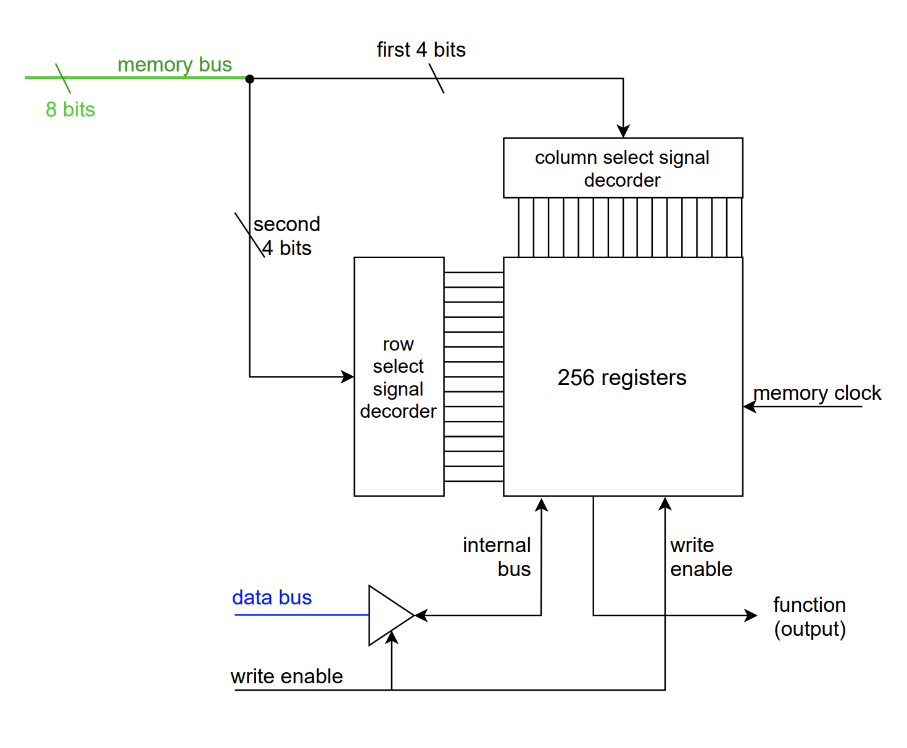
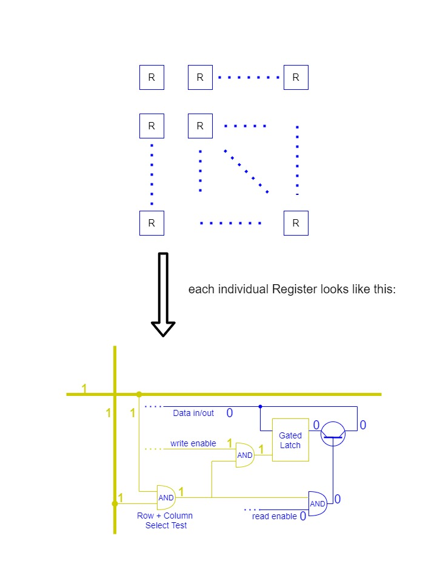
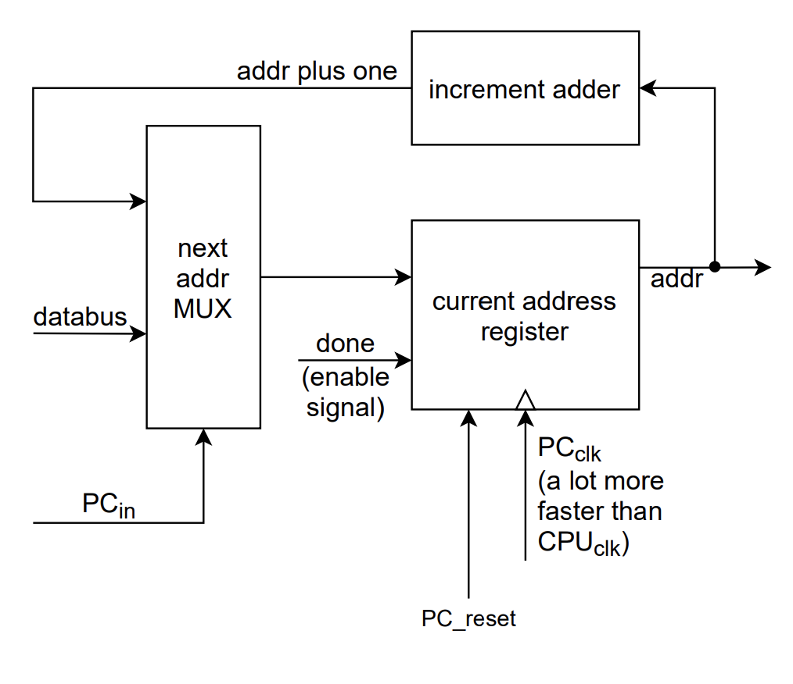
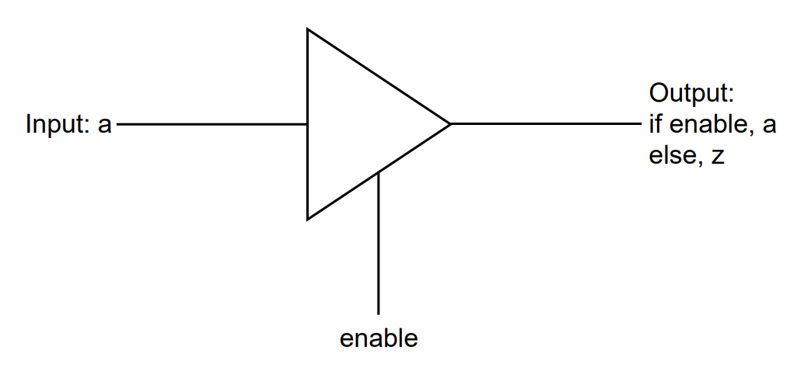

# Simple processor design

This is a simple processor (control circuit + ALU + memory) that can execute several instructions including load, add, sub, move, xor, ldPM, ldpc, and branch, with 256 bits of memory.

The whole project is written in Verilog.

## control circuit

The control circuit is a finite state machine, its state transfer diagram is shown below.

### FSM diagram
  

### Block diagram

The `function` will go into the `instruction decoder` which splits the function into two parts, one is the `instruction` and another one is the `operand`.

The instruction will go to `next state` combinational logic block along with another input:` curr`. The next state is calculated based on these inputs, and fed back to the `current state` register. 

As for the operands, it will directly go into the `output` logic block, along with the current state, some last state intermediate values. The output logic is the most sophisticated block that calculates the control signals. It produces multiple outputs(i.e. the control signals), some are required to be memorized temporarily (i.e. Rxinout, Ryinout and the memory address), they also go into the `some last state output register`, being memorized, fed back to the `output` block on the next clock rising edge.

### I/O explanation
- input
  - **function**: a 11 bits machine code, 3 bits for instruction, 3 bits for each operand(can be increased to 4 bits), and last 2 bits are left unused(except for the second operand of `load Rx, D`, `D` which is encoded by 6 bits)
  - **clk**: Clock signal
  - **reset**: Reset signal
- output
  - **Rin**: Rin is 4-bits-wide which can be considered as a concatenation of four wires: {R4in, R3in, R2in, R1in} (we currently have 4 registers)
  - **Rout**: likewise, Rout is 4-bits-wide which can be considered as a concatenation of four wires: {R4out, R3out, R2out,     R1out}
  - **ALU_a_in**: enable signal of A register in ALU.
  - **ALU_g_in**: enable signal of G register in ALU.
  - **ALU_g_out**: enable signal of the tri-state buffer connected right next to the G register in ALU.
  - **Done**: indicates that an instruction has been executed
  - **External_data**: opens the tri-state vector for outside-inputting data, which can be the second operand of `load Rx D` instruction.
  - **ALU_mode**: It's a two-bit output standing for three modes, 00 for `add`, and 01 for `sub`,  and 10 for `xor`.
  -  **PC_in**: write enable signal of the program counter
  - **PC_out**: enable signal of tri-state buffer which connects data bus and the output of program counter
  - **RAM_wren**: RAM write enable signal
  - **RAM_addr**: the address obtained from instruction.

## ALU

Our Arithmetic Logic Unit (ALU) is integrated to perform addition, subtraction, and xor operations. It is composed of 6 modules, including our register (`genral_purpose_reg`), tristate buffer (`tri_buf`), adder/subtractor (`nbits_fulladder`), mode decoder (`ALU_mode_decorder`) and output multiplexer (`ALU_output_MUX`) and the final data path module (AUL) which utilizes the above three. 

The general register module allows the implementation of general registers A and G in our data path, enabling value storage and further operations; the adder/subtractor provides ALU with the ability to add and subtract values; the tri-state buffer acts as a switch within the data path; the mode recorder enables the mode-switch between addition, subtractor and xor by using output-multiplexer to select desired output; and the ALU module assembles these modules to function and perform required addition, subtraction and xor operations.

### block diagram

The diagram below describes how Control Circuit controls the ALU.

what inside the **ALU: Adder/Subtractor**:

The ALU consists of three modes, 00 for addition, 01 for subtraction and 10 for xor. When the mode is selected (00, 01 or 10), the ALU_mode decoder will respond by producing respective outputs for later mode-selection in output-multiplexer amongst addition, subtraction and xor.

To simulate ALU's datapath functionality, external registers R1 and R2 will be used. Firstly, the control circuit would enable R1's tri-state buffer and disable R2's, to allow R1's data to be stored in the bus, then enable `Ain` to obtain R1 and store it in register A. Then similarly R2 is obtained and stored in the bus. The adder will perform its function (addition/subtraction) and produce corresponding outputs by obtaining R1 from register A and R2 from the bus. Xor would also operate to obtain a result for xor of R1 and R2 at the same time. Then the output-multiplexer (ALU_output_MUX) will select output from adder and xor according to requirement. `Gin` will be enabled next to store the selected output from the multiplexer. Then the tri-state buffer could be enabled by `Gout` enabled if the result of addition/subtraction/xor is needed to restore in the bus or any other external registers. 

### I/O explanation

* Input
  * **A** and **B**: operands
* output
  * the result

## Memory

In this project, a 256-bit memory is applied, the diagram below depicts how Control Circuit works with the Program Memory.

When `write enable` equals 0 , the output will be the internal instruction, which is the next instruction to be executed. When the `write enable` equals 1, it will load the data (instructions in our case) from the data bus into the program memory. The program counter will always point to the next instruction, when the first instruction finishes, the control circuit will produce a 1 from `done`, which is the increment flag of the program counter, the program counter increment itself so that it points to the very next instruction; otherwise it will just hold its previous value.

**Inside the Program Memory**:

The program memory has a 8 bits address from the memory bus, which separates into two 4-bit addresses, one of the 4 bits address will be decoded into 16 selecting signal wires that point to the column of the 256 bits register and similarly, another 4 bits address will also be decoded into 16 selecting signal wires that go to the row of the 256 bits register. by putting them together, we can precisely locate a register on a specific memory address. The `write enable` enables writing the data when it equals 1, the 16 bits data in the data bus will be transferred into the register with a unique 8 bits address number. When the `write enable` equals 0, it reads data from a specific memory address passed in, and it will be the output.

## Program Counter

This program counter is the register that stores the address of the instruction that is being executed at a time. This counter consists of inputs `PC-in`, `done`, `PC_clk`, `reset` and `Data_bus`, and output of `addr`. After each instruction is fetched without a reset signal, the program counter will point to the next instruction in the sequence by storing the address of the next instruction that is next to be executed. After the current instruction is executed, `done` would enable the current address register to increment its stored address by one if reset signal is not given. When the reset signal is given, the counter would revert its value to 0.

## Other parts

### Tri-state Vector

It acts like a switch.

