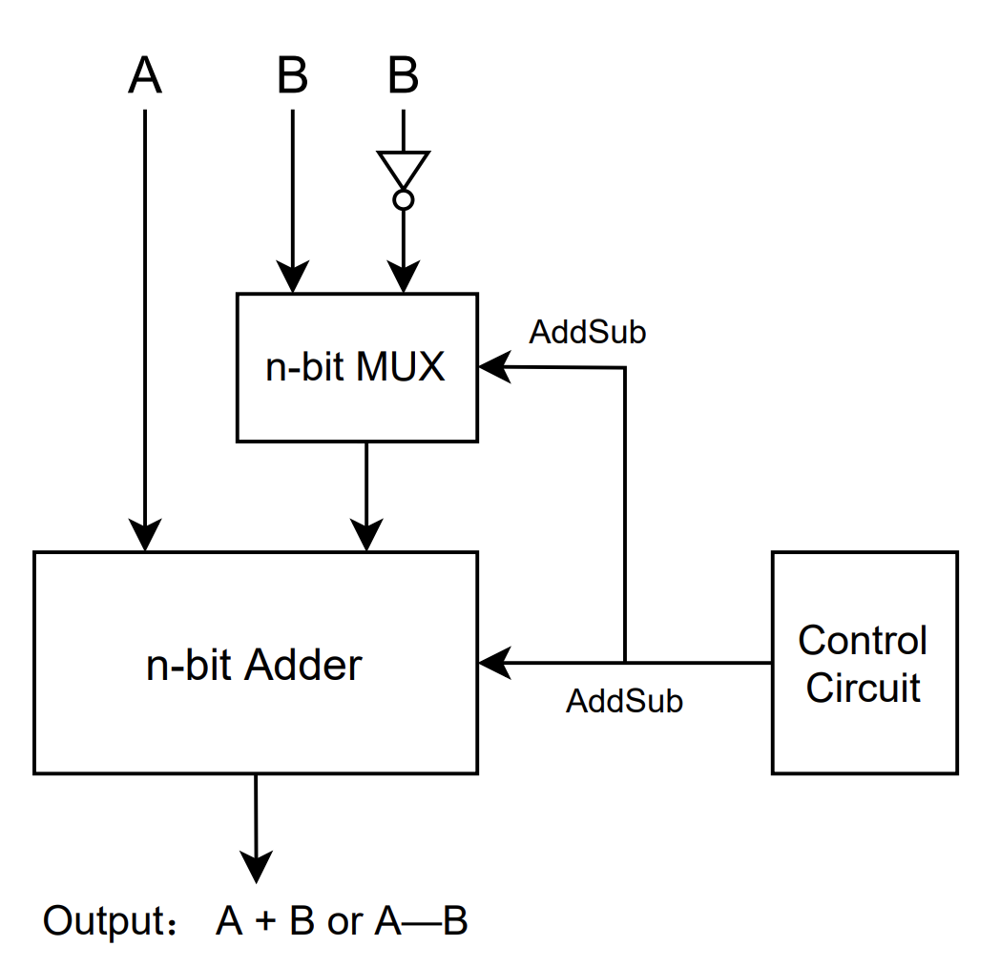
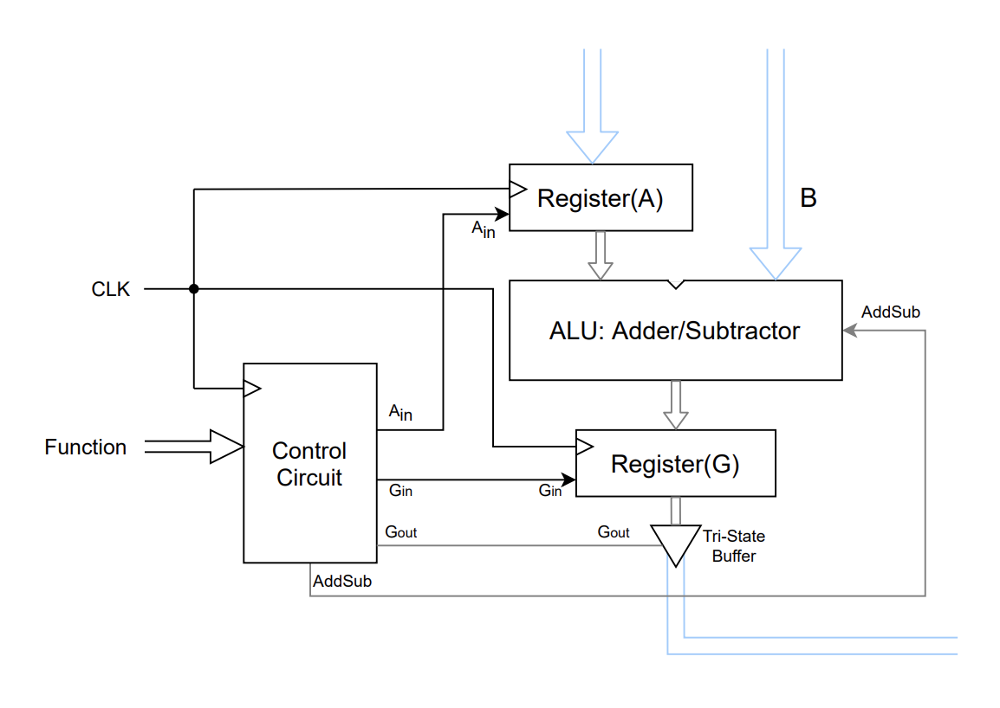
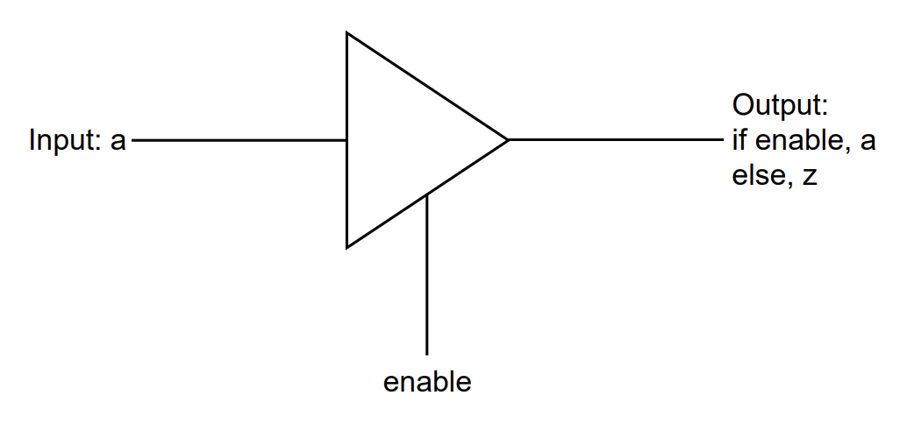
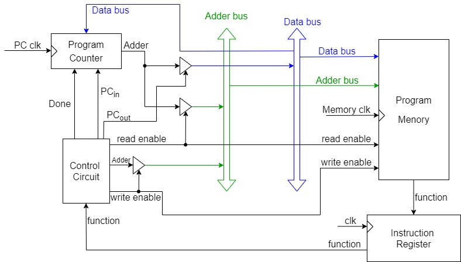
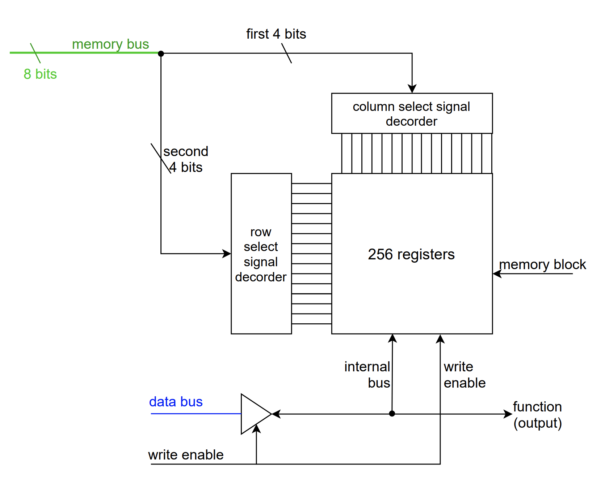
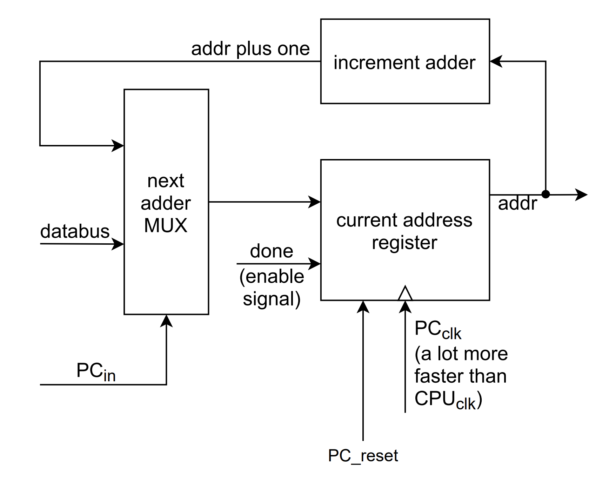

# Simple processor design

## control circuit
### FSM diagram
  
some more states to be added

### block diagram

### I/O explaination (almost done)
- input
  - **function**: a 11 bits machine code, 3 bits for instruction, 3 bits for each operand(can be increased to 4 bits), and last 2 bits are left unused(except for the second operand of `load Rx, D`, `D` here is encoded by 6 bits)
  - **clk**
  - **reset**
- output
  - **Rin**: Rin is 4-bits-wide which can be considered as a concatenation of four wires: {R4in, R3in, R2in, R1in} (we currently have 4 registers)
  - **Rout**: likewise, Rout is 4-bits-wide which can be considered as a concatenation of four wires: {R4out, R3out, R2out,     R1out}
  - **ALU_a_in**: please refer to the diagram in lecture 11, page 6
  - **ALU_g_in**: please refer to the diagram in lecture 11, page 6
  - **ALU_g_out**: please refer to the diagram in lecture 11, page 6
  - **Done**: indicates that an instruction has been executed
  - **External_data**: opens the tri-state vector for outside-inputing data(lecture 11, page 6), which can be the second operand of `load Rx D` instruction.
  - **ALU_mode**: two mode now, 0 for add, and 1 for sub, xor to be added in a short future

## ALU
### block diagram
AddSub
 

Datapath

### I/O explaination

## register and Tri-state Vector
register

Tri-state Vector
### block diagram

### I/O explaination

## memory
### block diagram
Overall

Program Memory

Program Counter

## Combine all these stuff together.
